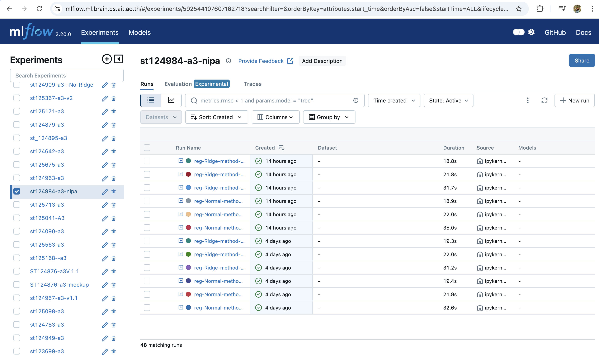
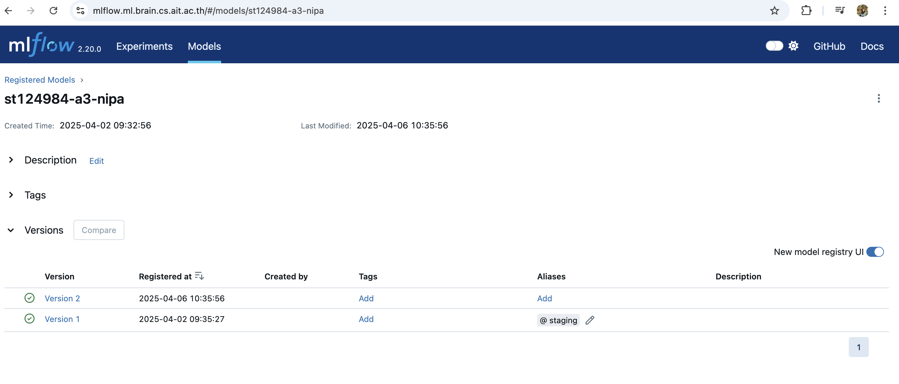
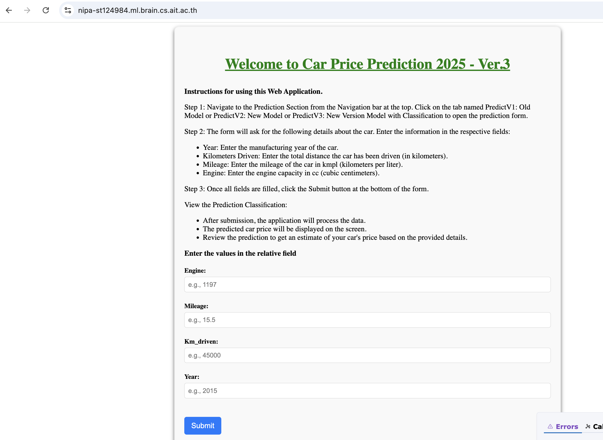

## A3 - Car Price Prediction: Web-Based Application with Machine Learning and CI/CD Integration

This project is a web-based application that predicts car prices using a machine learning model built with Dash by Plotly. The app features a clean and interactive user interface. If any form fields are left empty, the system intelligently handles missing values by auto-filling them before making predictions

## Project Structure
_A3_car_price_prediction/ – Contains Jupyter notebooks and all relevant project files.

main.py – Entry point and main application script.

model/ – Stores the machine learning model used for prediction.

test_pred.py – Script used for automated testing during the CI/CD process.

test/ – Contains additional test files for CI/CD.

.Dockerfile – Defines the required dependencies and setup for containerization.

docker-compose.yaml – Configuration file to run the app in a Docker container.

Screenshots/ – Includes images of the MLflow environment, model artifacts, and app UI hosted on the ML server.

README.md – Project overview and documentation.

requirements.txt – Lists all required Python packages and their versions.

## Application and Mlflow link :
server link: https://nipa-st124984.ml.brain.cs.ait.ac.th/
mlflow logs: https://mlflow.ml.brain.cs.ait.ac.th/<experiment_name: st124984-a3-nipa>

## Images Of Mlflow Experiment, Model And Website Design

